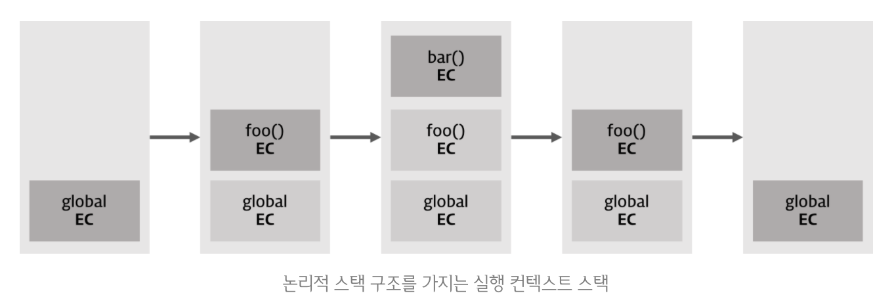

---
aliases:
  - Execution Context
---
# 실행 컨텍스트

```table-of-contents
```

##  실행 컨텍스트

>[!Information]
> - 실행 컨텍스트란, 실행할 코드에 제공할 환경 정보들을 모아놓은 객체
> - 자바스크립트의  동적 언어로서의 성격을 가장 잘 파악할 수 있는 개념
> 					- 정재남, 코어자바스크립트


## 자바스크립트와 실행 컨텍스트
- 실행 컨텍스트는 자바스크립트 코드가 실행되는 환경
- 자바스크립트 엔진은 코드를 실행할 때, 변수, 변수의 유효 범위, this 바인딩과 관련된 정보들을 필요로 함
- 어떤 실행 컨텍스트를 활성화 할 때, 자바스크립트 엔진은 해당 컨텍스트의 코드를 실행하는데 필요한 환경 정보들을 수집해서 실행 컨텍스트에 저장

- 실행 컨텍스트가 활성화 되면 아래의 현상들이 발생
	- `hoisting`
	- 외부 환경 정보 구성 -> `scope chaining`
	- this 값 설정

- 자바스크립트에서 실행 컨텍스트를 만드는 방법
	- 전역 코드 : 전역 영역 내의 코드
	- Eval 코드 : eval() 함수로 실행되는 코드 (eval 함수는 절대 사용 하지 말것)
	- 함수 코드 : 함수 내의 코드
	- 블록문(ES6+) : block 생성

### 자바스크립트 코드 실행 시 동작 과정

```js
var x = 'xxx'; // 전역 컨텍스트 
function foo () { 
	var y = 'yyy'; 
	function bar () { 
		var z = 'zzz'; 
		console.log(x + y + z); // xxxyyyzzz 
	} 
	bar(); // boo 실행 컨텍스트 
} 
foo(); // foo 실행 컨텍스트
```

- 실행 컨텍스트는 논리적 스택 구조
- 위 코드를 실행하면 아래 그림과 같이 실행 컨텍스트가 stack에 차례로 쌓임
- 함수가 하나씩 실행되면서 pop

```embed

```
1. JS를 실행하면, 먼저 Call Stack이라는 곳에 전역 실행 컨텍스트가 쌓임
	- foo() 함수 밖의 최상단 공간은 별도의 실행 명령 없이도 브라우저에서 자동으로 실행 되므로, JS가 실행되는 순간 전역 컨텍스트는 활성화 됨
	- 전역 컨텍스트는 어플리케이션이 종료(웹페이지 나가기, 브라우저 종료)될 때까지 유지
3. 코드 전체를 돌다가 foo() 함수가 호출되면 foo함수에 대한 환경 정보를 수집하여 새로운 foo() 실행 컨텍스트를 생성하고, Call Stack에 전역 실행 컨텍스트 위에 쌓음
4. foo 함수 실행 중 bar 함수 호출시, bar 함수에 대한 환경 정보를 수집하여 새로운 bar 실행 컨텍스트를 생성하여 Call Stack의 foo 함수 위에 쌓음
5. bar 함수 실행 중 console.log() 함수 실행 컨텍스트를 생성한 뒤, 값을 출력
6. bar함수 종료되면서 해당 실행 컨텍스트가 Call Stack에서 제거됨
7. foo 함수 종료되면 foo 함수 실행 컨텍스트도 Call Stack에서 제거됨

> [!Important]
> Call Stack의 최상단에 쌓여있는 실행 컨텍스트, 즉 가장 최근에 추가된 실행 컨텍스트만 활성화 됨


## 실행 컨텍스트의 구성

- Variable Environment와 Lexical Environment는 실행 컨텍스트에서 변수의 참조들을 기억하는 환경
- 일반적으로 함수의 Lexical Environment는 해당 함수가 가지는 자신의 로컬 스코프 범위를 말한다.
- 실행 컨텍스트를 생성할 때, Variable Environment에 환경 레코드와 외부 환경 정보를 먼저 담은 다음, 이를 복사하여 Lexical Environment를 생성
- 이 두 환경은 Environment Record와 outer environment reference로 구성
	- Environment Record 
		- 컨텍스트와 관련된 코드의 식별자 정보(매개변수의 이름, 함수 선언, 변수명 등)들이 저장되는 곳
		- 코드가 실행되기 전에 자바스크립트 엔진은 이미 해당 환경에 속한 코드의 변수명 등을 모두 알고 있게 됨 (hoisting)
	- Outer environment reference
		- 호출된 함수가 선언될 당시의 Lexical Environment를 참조하는 포인터로, 스코프 체이닝을 가능하케 함
		- 외부 환경 참조는 렉시컬 스코프를 기준으로 상위 스코프의 렉시컬 환경을 참조
		- 단방향 Linked List 형태로 구성
			- 가장 먼저 생성되는 전역 실행 컨텍스트의 외부 환경은 null로 참조할 환경이 없다.

### Variable Environment(변수 환경)
- environment record - 현재 컨텍스트 내의 식별자(변수)들에 대한 정보
- outer environment reference - 외부 환경 정보
- **선언 시점의 렉시컬 환경의 스냅샷(변경 적용X)**

### Lexical Environment(어휘적 환경)
- environment record - 현재 컨텍스트 내의 식별자(변수)들에 대한 정보
- outer environment reference - 외부 환경 정보
- 처음에는 Variable Environment와 동일 but, **변경 사항이 실시간으로 적용됨**
- 스코프와 식별자를 관리
	- 키와 값을 갖는 객체 형태의 스코프를 생성
	- 식별자를 키로 등록하고 식별자에 바인딩된 값을 관리


### This 바인딩

- this 식별자가 바라봐야 할 대상 객체
- 실행 컨텍스트가 활성화 될 때, this가 지정되지 않는다면 this에는 전역 객체가 저장됨


## 실행 컨텍스트 생성과 작동

- 함수 호출시 다음 순서로 실행 컨텍스트가 생성됨
	1. 함수 실행 컨텍스트 생성
	2. 함수 Lexical Environment 생성
		- 함수 Environment Record 생성
		- This 바인딩
		- Outer Environment Reference 결정

### 예시
```js
const str = '안녕';

function outer() {
  function inner() {
    const greeting = '하이';
    console.log(greeting);
    console.log(str);
  }
  inner();
}
outer();

console.log(str);
```

1. 전역 컨텍스트 생성
	- 전역 컨텍스트의 Environment Record에 { str, outer }이라는 식별자를 저장
	- 전역 컨텍스트는 최상위 컨텍스트이므로 Outer Environment Reference는 null
2. 전역 스코프에 있는 변수 str에 ‘안녕’, outer에 함수를 할당
3. outer()함수가 호출된다. 
	- 전역 실행 컨택스트는 중단 call stack의 전역 컨텍스트 위에 outer() 실행 컨텍스트가 추가
4. outer 컨텍스트의 Environment Record에 { inner }이라는 식별자를 저장
	- outer 컨텍스트의 Outer Environment Reference 에는 전역 컨텍스트의 렉시컬 환경이 담김
5. outer의 스코프에 있는 변수 inner에 함수를 할당
6. inner()함수 호출, outer() 실행 컨텍스트 중단 
	- call stack의 outer() 컨텍스트 위에 inner() 컨텍스트 추가 및 활성화
7. inner 컨텍스트의 Environment Record에 { greeting }이라는 식별자를 저장 
	- inner 컨텍스트의 Outer Environment Reference에는 outer 컨텍스트의 렉시컬 환경이 담김
8. inner의 스코프에 있는 변수 greeting에 ‘하이’ 할당
9. inner의 Lexical Environment Record에 있는 greeting을 찾아서 출력
10. inner의 Environment Record에 있는 str을 탐색 → 없음
11. inner()함수 종료 → call stack에서 pop()됨 → outer() 컨텍스트 활성화
12. outer()함수 종료 → call stack에서 pop()됨
13. 전역 컨텍스트 활성화
14. 전역 컨텍스트의 Environment Record에서 str을 찾아서 출력
15. 모든 함수가 실행이 종료도고, 모든 컨텍스트가 콜 스택에서 pop()됨 → 종료


### 변수 섀도잉(variable shadowing)

- 동일한 식별자로 인해, 상위 스코프에서 선언된 식별자의 값이 가려지는 현상
- 만약 inner에서 a 라는 변수를 찾을 때, outer에도 a 가 있고 global에도 a 가 있다면 outer의 a가 출력 됨